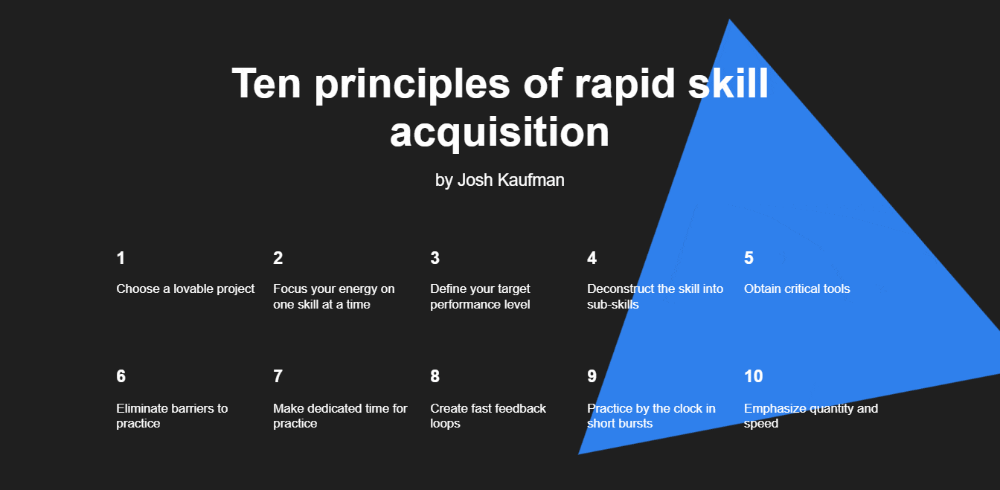

# Learning How to Learn

## Have a look at the project on GitHub Pages

<https://artemshchirov.github.io/how-to-learn/#en>

## Project Description

_This project is showcasing the knowledge Advanced HTML & CSS class._

It is a web page describing various learning strategies, from experts such as Barbara Oakley, Feynman, Salman Khan, and Josh Kaufman.

## Technologies and Techniques Used

This web page was created with HTML and CSS as a culmination of the skills learned in the Advanced HTML & CSS course.

## Some of the skills used are

- BEM methodology
- Element positioning
- Git
- Flexbox
- iframe
- CSS Animations

## Getting Started

```bash
1. git clone https://github.com/artemshchirov/how-to-learn.git
2. Use liveserver or open index.html
```

## Demo Functionality

### Animation 1


### Embed content


### Localization


### Animation 2


